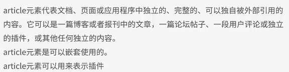

### 1.html5与html4的区别

#### 1.1全局属性

* contenteditable属性 ：当一个元素的contenteditable状态为true（contenteditable属性为空字符串，或为true，或为inherit且其父元素状态为true）时，意味着该元素是可编辑的。否则，该元素不可编辑。

  如果想要整个网页可编辑，可在body或html标签内设置contentEditable

  在浏览器地址栏输入data:text/html, <html contenteditable> ，即可打开一个简单的在线编辑器。

  ```css
  /*可以自定义样式如下：使用轮廓线代替边框，因为它不会向盒状模型添加元素，所以页面区域不会在触发时突然闪现。*/
  <style type="text/css">
  	[contenteditable]:hover, [contenteditable]:focus {
  		outline: 2px dotted red;
  	}
  </style>
  ```

  ```html
  <h2>contenteditable属性</h2>
  <ul contenteditable="true">
      <li>列表1</li>
      <li>列表2</li>
  </ul>
  ```

* designMode属性

  用来指定整个页面是否可编辑，有两个值，on和off。该属性只能用javascript来修改值。如果design设置为on，则所有允许设置contenteditable的元素都可编辑。

  ```javascript
  window.document.designmode="off";
  ```

* hidden属性（非表单hidden属性）

  ```html
  <h2>hidden属性（非表单hidden属性）</h2>
  <ul hidden="hidden">
  	<li>列表1</li>
  	<li>列表2</li>
  </ul>
  ```

* spellcheck属性

  规定是否必须对元素进行拼写或语法检查。用了spellcheck属性，浏览器会帮助检查html元素文本内容拼写是否正确，只有当html元素在可编辑状态，sepllcheck属性才有意义，所以一般是针对input[text],textarea元素用户输入内容进行拼写和语法检查，拼写错误有红色的波浪下划线，**右键会给提示。**

  ```html
  <textarea spellcheck="true" cols="60" rows="5"> </textarea>
  ```

  

* tabindex属性

  tabindex 属性**规定元素的 tab键切换顺序**（当 tab 键用于导航时），可将tabIndex属性设成1到32767的一个值。

  Note：tabindex属性设为一个负值（如tabindex="-1")时，用户使用tab键切换时该html元素将不会被选中。

  ```html
  <form>
  	<label>姓名: <input type="text" name="name" tabindex="2"/></label><br/>
  	<label>身份证号: <input type="text" name="city" tabindex="-1"/></label></br>
  	<label>准考证号: <input type="text" name="country" tabindex="1"/></label></br>
  	<input type="submit" value="查询" tabindex="3"/>
  </form>
  ```

  

#### 1.2html5与html4的区别

##### 1.2.1 推出的理由


##### 1.2.2 语法的改变


##### 1.2.3 新增的元素和废除的元素


##### 1.2.4 新增的属性和废除的属性


##### 1.2.5 全局属性（见1.1全局属性）

### 2.新增的主体结构元素

#### 2.1 article元素



```html
<article>
  <header>
    <h1>主标题</h1>
  </header>
  <aside id="entry-meta">作者:xxx 时间:<time datetime="xxxx-xx-xx">xxxx-xx-xx</time></aside>
  <div id="entry-content"><p>内容描述</P></div>
</article>
```

#### 2.2 aside元素


表示article标签内容之外的，与article标签内容相关的辅助信息。

#### 3.3 nav元素


```html
<nav>
  <ul>
    <li>首页</li>
    <li>导航1</li>
    <li>导航2</li>
  </ul>
</nav>
```

#### 3.4 section元素


#### 3.5 time元素和微格式

time标签用来标记文章发布时间，可以让机器、搜索引擎等例句这篇文章是什么时间发表的。

html4

抓取时间为发布时间或者从文章中抓取类似“本文发不要xx”的文字进行分析。

```html
<div id="meta">本文写于 xxxx-xx-xx</div>
```

html5

```html
<aside>本文写于 <time datetime="2012-9-27">xxxx-xx-xx</time></aside>
<aside>本文写于 <time datetime="2012-9-27" pubdate="pubdate">xxxx-xx-xx</time></aside>
```

pubdate属性是为了标记正确的发布时间，比如：

```html
<h1>关于9月28日北校区宿舍楼停电公告</h1>
<aside>发布日期:<time datetime="2012-9-27" pubdate="pubdate">2012年9月27日</time></aside>
```

用 pubdate 规定正确的发布时间，但是需要注意，在 W3C 标准中，并没有 pubdate 这个属性，这个属性是由 mozilla 他们自己规定的。所以添加 pubdate 属性之后，无法通过 W3C 的 HTML5 验证。

### 3.新增的的非主体结构元素

#### 3.1 address 元素


#### 3.2 header

表示一个内容区块或者整个页面的标题。

```html
<header>
	<h1>页面标题</h1>
</header>
```

#### 3.3 footer

表示整个页面或页面中一个内容区块的脚注。一般来说，它会包含创作者的姓名、创作日期及创作者的联系信息或者公司的备注信息。

公司网站底部通常用来说明网站信息的版权，网站所有者，备案等。

```html
<footer>Copyright © 2015 xxx.com All Rights Reserved | 京ICP备 xxxxxxxx号-2</footer>
```

### 4.表单新增元素与属性

#### 4.1 form属性

对input[所有类型]、output、select、textarea、button与fieldset指定form属性。它声明属于哪个表单，然后将其放置在页面的任何位置，都在表单之内。这个属性解放了form表单里的元素，给我们在复杂的布局时带来方便。

**Note**：

一个输入域可以属于一个或多个表单，多个表单用空格分隔开。

输入域的form属性必须引用所属表单的id，这点有点像<label>标签的for属性。

举例：

```html
<form action="" method="" id="user_form">
<p>用户名：<input type="text" autofocus placeholder="用户名"/></p>
</form>
<p>下面的密码框在form表单之外，但仍然属于form表单会被提交到服务器</p>
<p>密码：<input type="password" placeholder="密码" form="user_form"/></p>
```


重置表单默认行为的新属性

html5中表单的自由度非常高，因为html5为input[submit,image]、button元素增加formaction、formenctype、formmethod、formnovalidate与formtarget几个新属性，能对form元素的某些属性重置，比如能做到表单1的提交按钮提交表单2等。

formaction：重写表单action属性

formenctype：重写表单enctype属性

formmethod：重写表单method属性

formnovalidate：重写表单novalidate属性

formtarget：重写表单target属性

举例：formaction和formmethod

html中，一个表单内的所有元素都通过表单的action属性统一提交到另一个页面。html5中可通过formaction属性实现点击不同提交按钮，将表单提交到不同的页面。

html中一个表单只有一个action属性来对表单内所有元素统一指定提交页面，每个表单只有一个method属性统一指定提交方法。html5中新增的formmethod方法，可以实现不同按钮指定不同提交方法，比如post，get等。

```html
<form action="server.jsp" method="get" id="user_form">
     E-mail:
     <input type="email" name="useremail" /><br />
     <input type="submit" formmethod="get"  formaction="s1.jsp" value="get方法提交到s1.jsp" /><br />
     <input type="submit" formmethod="post" formaction="s2.jsp" value="post方法提交到s2.jsp" /><br />
</form>
```


点"get方法提交到s1.jsp"按钮，将表单以get方法提交到s1.jsp页面，从url也可以看出地址栏显示提交参数。

点"post方法提交到s2.jsp"按钮，将表单以post方法提交到s2.jsp页面。

举例：formnovalidate属性，可以取消提交时进行的有关检查，表单可以被无条件地提交[哪怕form里有required,min,max等]。

```html
<form action="demo_form.jsp" method="get" id="user_form">
    E-mail:　　 <input type="email" required name="useremail" /><br />
    <input type="submit" formnovalidate="true"  value="Submit without validation" /> 
</form>
```

点击“Submit without validation”按钮时，Form 不会做任何校验，虽然有required属性，表单空仍然可以提交。

#### 4.2 autofocus属性

对input[所有类型]、select、textarea与button指定autofocus属性。它以指定属性的方式让元素在页面加载后自动获得焦点。**一个页面只能有一个元素有autofocus属性，同时设置多个，则第一个生效。**

这个属性对登录页面很有用，可提升用户体验，有时登录页面就一个用户名，密码，页面加载后用户要手动定位到输入框，才能输入，有了autofocus，页面打开即可直接输入。

举例：

```html
<form>
	<p>用户名：<input type="text" autofocus /></p>
	<p>密码：<input type="password"/></p>
</form>
```


#### 4.3 placeholder属性

对input[text, search, url, telephone, email 以及 password]、textarea指定placeholder属性，它会对用户的输入进行提示，提示用户期待什么样的输入。

**当输入框获取焦点时，提示字符消失。**

这个属性也能提升用户体验，用的已经相当普遍了。

举例：

```html
<form>
	<p>用户名：<input type="text" autofocus placeholder="用户名"/></p>
	<p>密码：<input type="password" placeholder="密码"/></p>
</form>
```

#### 4.4 required属性

该属性表示用户提交时检查该元素输入域不能为空。

适用于以下类型的 input[text, search, url, telephone, email, password, date pickers, number, checkbox, radio, file]。

举例：

```html
<form action="" method="" id="user_form">
	<p>用户名：<input type="text" autofocus placeholder="用户名" required/></p>
	<p><input  type="submit" value="提交"/></p>
</form>
```


#### 4.5 label增加control属性

html5中为标签新增了control属性，在标签内部放置一个表单元素，通过标签的control属性访问该表单元素。

举例：

```html
<script>
    function setValue(){
        var label=document.getElementById("label");
        label.control.value="718308";
    }
</script>
<form>
  <label id="label">
      邮编：<input id="txt_zip" maxlength="6">
      <small>请输入6位数字</small>
  </label>
  <input type="button" value="设置默认值" onclick="setValue()">
</form>
```


分析：通过label的control属性控制input输入框的value，所以点“设置默认值”按钮，将邮编输入框值初始化为"718308"。

#### 4.6 复选框的indeterminate属性

这个属性用来表示复选框部分选中，像qq邮箱中，邮件部分选中就有这样的效果。


举例：经测试，貌似还是必须通过脚本控制indetermidate属性。

```html
<form>
     <input type="checkbox" checked/>
     <input type="checkbox" indeterminate/>只写一个indeterminate不起作用
     <input type="checkbox" id="test"/>
     <input type="checkbox" />
</form>
 <script>
    document.getElementById('test').indeterminate = true;
</script>
```


indeterminate属性主要是在复选框嵌套时使用，了解更多可参考[css-tricks indetermidate-checkboxes](https://css-tricks.com/indeterminate-checkboxes/)

#### 4.7 selectionDirection属性

selectionDirection适用于input元素和textarea元素。

用户在input元素或textarea元素中用鼠标选取部分文字时，可以使用该属性来获取选取方向。当用户正向选取文字时，该属性值为"forward"，反向选取值为“backward”，且当用户没有选取任何文字时，该属性值为"forward"。

举例：

```html
<script type="text/javascript">
    function alertSelectionDirection(){
        var testInput=document.getElementById("test");
        var direction=testInput.selectionDirection;
        alert(direction);
    }
</script>
<form>
    <input type="text" name="text" id="test">
    <input type="button" value="查看选中文本方向" onclick="alertSelectionDirection()"> 
</form>
```


#### 4.8 image提交按钮新增width,height属性

width和height来设置image类型的input标签的图像的宽高。

举例：用来作为提交按钮，通过width和height设置其宽高。

```html
<form action="server.jsp" method="get" id="user_form">
     E-mail:
     <input type="email" name="useremail" /><br />
     <input type="image" src="img/submit.png"  width="30px" height="30px"/>
</form>
```


#### 4.9 list属性

list属性与 [datalist](http://www.cnblogs.com/starof/p/4581850.html#datalist) 标签配合使用，用来规定输入域的datalist。datalist是输入域的选项列表，该元素类似 select ，但是比select更好的一点在，当用户要设定的值不在选择列表内时，允许自行输入,该元素本身不显示，当文本框获得焦点时以提示输入的方式显示。

list属性适用于input[text,search,url,telephone,email,datepickers,numbers,range,color]

**Note**:

list值为文档中的 datalist 的 id，又看到了熟悉的id，回想一下form属性引用的是表单的id，都类似label属性引用input的id一样。

举例：

```html
<form action="demo_form.jsp" method="get">
    主页:<input type="url" list="url_list" name="link" />
    <datalist id="url_list" autocomplete>
        <option label="baidu" value="http://www.baidu.com" />
        <option label="qq" value="http://www.qq.com" />
        <option label="Microsoft" value="http://www.microsoft.com" />
      </datalist>
    <input type="submit" />
</form>
```


举例：顺便说一下datalist和autocomplete配合使用

前面讲了autocomplete属性可以让用户完成域输入时，浏览器在该域内显示填写的选项。现在datalist元素与autocomplete属性配合使用可更好的提升用户体验。

在上面代码基础上给datalist增加autocomplete属性

```html
<datalist id="url_list" autocomplete>
```

用户第一次输入http://www.google.com提交后，再次输入时会同时给出datalist的option提示和autocomplete增加的提示。


#### 4.10 pattern属性

pattern属性用于验证输入字段的模式，其实就是正则表达式，不用再写js绑定正则验证了，非常方便。

pattern属性适用于input[text,search,url,telephone,email,password]

举例：给输入框定义了 Pattern 为“**[A-z]{3}**”，也就是包含三个字母的正则表达式约束，如果输入不合法，我们会看到如下效果。

```html
<form action="#" method="get" id="user_form">
    Country code:
    <input type="text" name="country_code" pattern="[A-z]{3}" title="Three letter country code" />
    <input type="submit" />
</form>
```


### 5.改良的 input 元素的种类

#### 5.1 email

必须输入email

```html
<form>
	<label for="user_mail">邮箱：</label>
	<input type="email" name="user_email" id="user_mail" />
	<button type="submit">提交</button>
</form>	
```


#### 5.2 url

必须输入url地址

```html
<form>
	<label for="user_url">url：</label>
	<input type="url" name="user_url" id="user_url" />
	<button type="submit">提交</button>
</form>
```


#### 5.3 number

必须输入数值

```html
<label>number:<input type="number"  name="points" min="1" max="10" step="1"/></label>
```

#### 5.4 range

必须输入一定范围内的数值

```html
<label>range:<input type="range" name="points" min="1" max="10" /></label>
```


#### 5.5 Date Pickers(日期选择器)

拥有多个可供选取日期和时间的新输入类型。

date - 选取日、月、年 
month - 选取月、年 
week - 选取周和年 
time - 选取时间（小时和分钟） 
datetime - 选取时间、日、月、年（UTC 时间） 
datetime-local - 选取时间、日、月、年（本地时间）

```html
<label>date日月年：<input type="date" name="user_date" /></label>
<label>month月，年：<input type="month" name="user_month"></label>
<label>time小时，分钟：<input type="time" name="user_time"></label>
<label>datetime时间，日，月，年（UTC时间）<input type="datetime" name="user_datetime"></label>
```


firefox不支持。

#### 5.6 search

用于搜索域，语义化更明确，域显示为常见的文本域。

```html
<label>search：<input type="search" name="search" /></label>
```


#### 5.7 color

```html
<label>color：<input type="color" name="color" /></label>
```


### 6.媒体标签

html5对媒体标签的支持非常好，把它们变成跟文字，图片同样重要的标签。

#### 6.1 video标签

定义视频，像电影片段或其他视频流而不用再使用第三方插件。现在主要支持 Ogg 和 MPEG 两种视屏格式。

例：

html5：

```html
<video src="movie.ogg" controls> video标签</video>
```

或者还能够通过“controls”属性设置是否显示控制按钮，“preload”是否在页面加载时预加载视屏。

```html
<video width="320" height="240" controls> 
 	<source src="movie.ogg" type="video/ogg"> 
 	<source src="movie.mp4" type="video/mp4"> 
	Your browser does not support the video tag. 
</video>
```

html:

```html
<object type="video/ogg" data="movie.ogv">
	<param name="src" value="movie.ogv">
</object>
```

video总共有 30 多个常用的属性功能，以下常用：

- currentSrc：当前的视屏源
- initialTime：初始化的时间点
- readyState：当前视屏播放的状态
- currentTime：视频的当前时间
- duration：视频的时间总长
- playbackRate：播放的速率，通过该属性可以实现快进，慢放等等
- autoplay：是否自动播放
- muted：是否静音

vedio有很多实用的方法和事件

load()、play()、pause() 等等控制着视频的加载，播放和暂停。可监听的事件也是相当丰富：

- "onloadstart" // 客户端开始请求数据时触发
- "onprogress" // 客户端请求数据过程中
- "onabort" // 客户端主动终止下载时触发
- "onerror" // 请求数据时遇到错误时触发
- "onplay" //play() 和 autoplay 开始播放时触发
- "onpause" //pause() 时触发
- "onloadedmetadata" // 成功获取资源长度时触发
- "onloadeddata" // 成功获取视频资源时触发
- "oncanplay" // 视频可以播放时触发（但中途可能因为加载而暂停）
- "oncanplaythrough" // 可以播放，视频 / 音频全部加载完毕
- "ontimeupdate" // 播放时间改变时触发
- "onended" // 播放结束时触发
- "onratechange" // 播放速率改变时触发
- "ondurationchange" // 资源长度改变时触发
- "onvolumechange" // 音量改变时触发

#### 6.2 audio标签

定义音频，如音乐或其他音频流。

html5:

```html
<audio src="someaudio.wav">audio标签</audio>
```

或者：

```html
<audio controls="controls"> 
  	<source src="song.ogg" type="audio/ogg"> 
  	<source src="song.mp3" type="audio/mpeg"> 
 	Your browser does not support the audio tag. 
</audio>
```


html中：

```html
<object type="application/ogg" data="someaudio.wov">
	<param name="src" value="someaudio.wov">
</object>
```

#### 6.3 embed标签

定义外部的可交互的内容或插件，用来嵌入内容（包括各种媒体）。

格式可以是Midi,Wav,AIFF,AU,MP3,flash等。可以在不使用插件的情况下操作媒体文件，极大提升用户体验。

例：

html5：

```html
<embed src="flash.swf" />
```

html中：

```html
<object data="flash.swf" type="application/x-shockwave-flash"></object>
```

### 7 其他功能标签

#### 7.1 mark标签

黄色高亮显示选择文本。主要用来在视觉上向用户呈现哪些需要突出显示或高亮显示的文字。典型应用搜索结果中高亮显示搜素关键字。

举例：

```html
<p>html5:一段文字<mark>高亮显示</mark></p>
<p>html:一段文字<span style="background-color:yellow;">高亮显示</span></p>
```


#### 7.2 progress标签

状态标签（任务过程：安装、加载）。

表示运行中的进程，可以使用progress元素显示JavaScript中耗时时间函数的进程。等待中……、请稍后等。

```html
<progress value="40" max="100">40%</progress>
```


#### 7.3 details标签

用于描述文档或文档某个部分的细节 。 
可与 **summary** 标签配合使用，summary可以为 details 定义标题。标题是可见的，用户点击标题时，会显示出 details。summary应该是details的第一个子元素。

**tip**:可以通过<details open>添加一个open属性，默认显示展开状态。

举例：details配合summary实现总结-详细效果：

```html
<details>
    <summary>Name & Extension:</summary>
    <p>
        <input type=text name=fn value="Pillar Magazine.pdf"/>
    </p>
    <p>
        <label>
            <input type=checkbox name=ext checked/>
            Hide extension
        </label>
    </p>
</details>
```


### 8. 废除标签

#### 8.1 可以使用css代替的标签

 删除basefont,big,center,font,s,strike,tt,u这些纯表现的元素,html5中提倡把画面展示性功能放在css中统一编辑。。

#### 8.2 html5不再使用frame

不再用frame,noframes和frameset，这些标签对可用性产生负面影响。HTML5中不支持frame框架，只支持iframe框架，或者用服务器方创建的由多个页面组成的符合页面的形式，删除以上这三个标签。

#### 8.3 只有个别浏览器支持的标签

bgsound背景音乐，blink文字闪烁，marquee文字滚动,applet

#### 8.4 其他不常用的标签

ul替代dir

pre替代listing

code替代xmp

ruby替代rb

abbr替代acronym

废除isindex使用form与input相结合的方式替代。

废除listing使用pre替代

废除nextid使用guids

废除plaintex使用“text/plian”（无格式正文）MIME类型替代。