### createRange

Range对象代表页面上的一段连续区域，通过Range对象，可以获取或修改页面上的任何区域，可以通过如下创建一个空的Range对象，如下：

```javascript
 var  range = document.createRange();
```

在html5中，每一个浏览器窗口及每一个窗口中都有一个selection对象，代表用户鼠标在页面中所选取的区域，

(注意：经过测试**IE9以下**的浏览器不支持Selection对象), 

可以通过如下语句创建selection对象；

```javascript
  var  selection = document.getSelection();     
  //或者
  var  selection  = window.getSelection();
```

每一个selection对象都有一个或者多个Range对象，每一个range对象代表用户鼠标所选取范围内的一段连续区域

在firefox中，可以通过ctrl键可以选取多个连续的区域，因此在firefox中一个selection对象有多个range对象

在其他浏览器中，用户只能选取一段连续的区域，因此只有一个range对象。

### getRangeAt方法

可以通过selection对象的getRangeAt方法来获取selection对象的某个Range对象，如下：

```javascript
var range = document.getSelection().getRangeAt(index);
```

getRangeAt方法有一个参数index，代表该Range对象的序列号；我们可以通过Selection对象的rangeCount参数的值判断用户是否选取了内容；

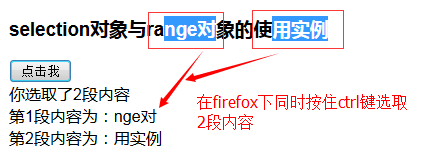

```html
<script>
    function rangeTest() {
        var html;
        var showRangeDiv=document.getElementById("showRange");
        var selection=document.getSelection();
        console.log(selection);
        if(selection.rangeCount>0){
            html="您选取了"+selection.rangeCount+">段内容<br/>"
            for(var i=0;i<selection.rangeCount;i++){
                var range=selection.getRangeAt(i);
                html+="第"+(i+1)+"段内容为："+ range+"<br/>";
            }
            showRangeDiv.innerHTML=html;
        }
    }
</script>
</head>
<body>
    Selection与Range对象的使用
    <input type="button" value="点击我" onclick="rangeTest()">
    <div id="showRange"></div>
</body>
```

### **selectNode方法**

​	Range对象的selectNode方法用于将Range对象的起点指定为某个节点的起点，将Range对象的终点指定为该节点的终点，使Range对象所代表的区域中包含该节点。

​	使用方法：rangeObj.selectNode(node);

​	说明：上面的 rangeObj 代表一个Range对象，该方法使用一个参数，代表页面中的一个节点。

### **selectNodeContents方法**

​	用于将Range对象的起点指定为某个节点中的所有内容的起点，将Range对象的终点指定为该节点所有内容的终点，使Range对象所代表的区域中包含该节点的所有内容。

​	使用方法：rangeObj.selectNodeContents(node);

### **deleteContents方法**

​	用于将Range对象中所包含的内容从页面中删除

​	使用方法：rangeObj.deleteContents();

```html
<script>
    function deleteRangeContent (onlyContent) {
        var div=document.getElementById("div");
        var rangeObj=document.createRange();
        if(onlyContent){
            rangeObj.selectNodeContents(div);
            rangeObj.deleteContents();
        }else{
            rangeObj.selectNode(div);
            rangeObj.deleteContents();
        }
    }
</script>
</head>
<body>
<div id="div" style="background-color:aquamarine;width:300px;height:50px">
    元素中内容
</div>
<button onclick="deleteRangeContent (true)">删除内容</button>
<button onclick="deleteRangeContent (false)">删除元素</button>
</body>
```

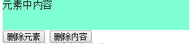 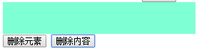 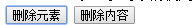


### **setStart方法**

用于将某个节点中的某处位置指定为Range对象所代表区域的起点位置

​	使用方法如下：rangeObj.setStart(node,curIndex);

​	如上代码rangeObj代表一个Range对象，该setStart方法使用2个参数，第一个参数node代表一个节点，第二个参数是一个数字，当第一个参数node所代表的节点是一个内容为一段文字的文字节点时，该参数值用于指定将第几个文字的结束位置作为Range对象所代表的区域的起点位置；当第一个参数node所代表的节点中包括其他子节点时，该参数值用于将第几个子节点的结束位置指定为Range对象所代表的区域的起点位置；

### **setEnd方法**  

用于将某个节点中的某处位置指定Range对象所代表区域的结束位置。

使用方法：rangeObj.setEnd(node,curIndex);

该方法中的2个参数的含义如setStart方法中参数的含义相同；只不过一个是起点位置，另一个是结束位置；

### **setStartBefore方法**

用于将某个节点的起点位置指定为Range对象所代表区域的起点位置。

### **setStartAfter方法**

 用于将某个节点的终点位置指定为Range对象所代表区域的起点位置。

### **setEndBefore方法**

 用于将某个节点的起点位置指定为Range对象所代表区域的终点位置。

### **setEndAfter方法**

用于将某个节点的终点位置指定为Range对象所代表区域的终点位置。

```html
<script>
function deleteChar() {
    var div=document.getElementById("mydiv");
    //节点中的第一个子元素,对象，如果节点中没有包含第一个子元素，将传回null
    var textNode=div.firstChild;
    var rangeObj=document.createRange();
    //删除第一个字段到第四个字段
    rangeObj.setStart(textNode,1);
    rangeObj.setEnd(textNode,4);
    rangeObj.deleteContents();
}
</script>
</head>
<body>
<div id="mydiv">12345测试删除文字功能aaaaa</div>
<button onclick="deleteChar()">删除文字</button>
</body>
```

```html
<script>
function deleteRow() {
    var table=document.getElementById("myTable");
    if(table.rows.length>0){
        var firstrow=table.rows[0];
        var rangeObj=document.createRange();
        rangeObj.setStartBefore(firstrow);
        rangeObj.setEndAfter(firstrow);
        rangeObj.deleteContents();
    }
}
</script>
</head>
<body>
<table id="myTable" border="1" cellspacing="0" cellpadding="0">
    <tr>
        <td>内容11</td>
        <td>内容12</td>
        <td>内容13</td>
    </tr>
    <tr>
        <td>内容21</td>
        <td>内容22</td>
        <td>内容23</td>
    </tr>
</table>
<button onclick="deleteRow()">删除第一行</button>
</body>
```

### **cloneRange方法**

​	Range对象的cloneRange方法用于对当前的Range对象进行复制，该方法返回复制的Range对象

```html
<script>
function cloneRange() {
    var rangeObj=document.createRange();
    var p=document.getElementById("p");
    rangeObj.selectNodeContents(p)
    var rangeClone=rangeObj.cloneRange();
    alert(rangeClone.toString());
}
</script>
</head>
<body>
<p id="p">这里是内容</p>
<button onclick="cloneRange()">克隆</button>
</body>
```

### **cloneContents方法**

​	cloneContents方法 用于在页面上追加一段HTML代码，并且将Range对象所代表区域中的HTML代码克隆到被追加的html代码中

```html
<script>
  function cloneContent() {
      var div=document.getElementById("div1");
      var rangeObj=document.createRange();
      rangeObj.selectNodeContents(div);
      var docFrangMent=rangeObj.cloneContents();
      div.appendChild(docFrangMent);
  }
</script>
</head>
<body>
<div id="div1">
    *小萌货*
    <br/>
    <button onclick="cloneContent()">克隆</button>
    <br/>
</div>
```

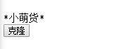 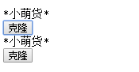 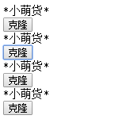

### extractContents方法

extractContents方法 用于将Range对象所代表区域中的html代码克隆到一个DocumentFragment对象中，然后从页面中删除这段HTML代码

```html
<script>
function moveContent() {
    var srcDiv=document.getElementById("srcDiv");
    var disDiv=document.getElementById("disDiv");
    var rangeObj=document.createRange();
    rangeObj.selectNodeContents(srcDiv);
    var docFrangment=rangeObj.extractContents();
    disDiv.appendChild(docFrangment);
}
</script>
</head>
<body>
<div id="srcDiv" style="background-color: cornflowerblue;width:300px;height: 50px">么么哒</div>
<div id="disDiv" style="background-color: #ff6471;width:300px;height: 50px"></div>
<button onclick="moveContent()">移动元素</button>
</body>
```

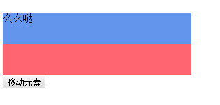 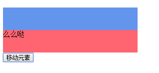

### insertNode方法

​	该方法用于将指定的节点插入到某个Range对象所代表的区域中，插入位置为Range对象所代表区域的起点位置，如果该节点已经存在于页面中，该节点将被移动到Range对象代表的区域的起点处。

```html
<script>
function moveButton() {
    var btn=document.getElementById("button");
    var selection=document.getSelection();
    if(selection.rangeCount>0){
        var range=selection.getRangeAt(0);
        range.insertNode(btn);
    }
}
</script>
</head>
<body>
<div onmouseup="moveButton()" style="width:400px;background-color: cornflowerblue">
    web前端 HTML5 hello world
</div>
<button id="button">按钮</button>
</body>
```

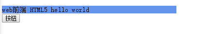 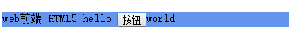

### compareBoundaryPoints方法

```html
<script>
function compare() {
    var boldText=document.getElementById("boldTest");
    var boldRange=document.createRange();
    boldRange.selectNodeContents(boldText.firstChild);
    var selection=document.getSelection();
    if(selection.rangeCount>0) {
        var selRange = selection.getRangeAt(0);
        if (selRange.compareBoundaryPoints(Range.START_TO_END, boldRange) <= 0) {
            alert("选取的文字在粗体前面");

        } else {
            if (selRange.compareBoundaryPoints(Range.END_TO_START, boldRange) >= 0)
                alert("选取的文字在粗体的后面");
        }
    }
}
</script>
</head>
<body>
<div>
    下雨天了怎么办，<b id="boldTest">突然</b>好想你。
    <br/>
    <button onclick="compare()">位置比较</button>
</div>
</body>
```

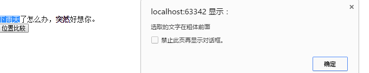 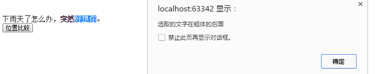


### collapse 方法

通过使用 collapse 方法将 Range 对象所代表的区域的终点移动到该区域的起点处，或将 Range 对象所代表区域的起点移动到终点出。

```html
<script>
var rangeObj=document.createRange();
function selectRangeContens() {
    var div=document.getElementById("div");
    rangeObj.selectNode(div);
}
function  unselect() {
    rangeObj.collapse(false);
}
function showRange() {
    alert(rangeObj.toString());
}
</script>
</head>
<body>
<div id="div" style="background-color: cadetblue; width: 300px;height: 50px;">
    说好的幸福呢？
</div>
<button onclick="selectRangeContens()">选择元素</button>
<button onclick=" unselect()">取消元素</button>
<button onclick="showRange() ">显示Range内容</button>
</body>
```

选择元素后点击显示内容

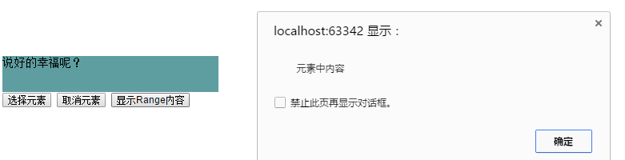

取消元素后显示的情况

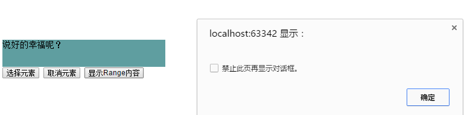


### **detach**

 range的detach方法如：rangeObj.detach()释放Range对象，释放后其他事件就不成立了，主要用于释放Range对象来提升应用的性能。

